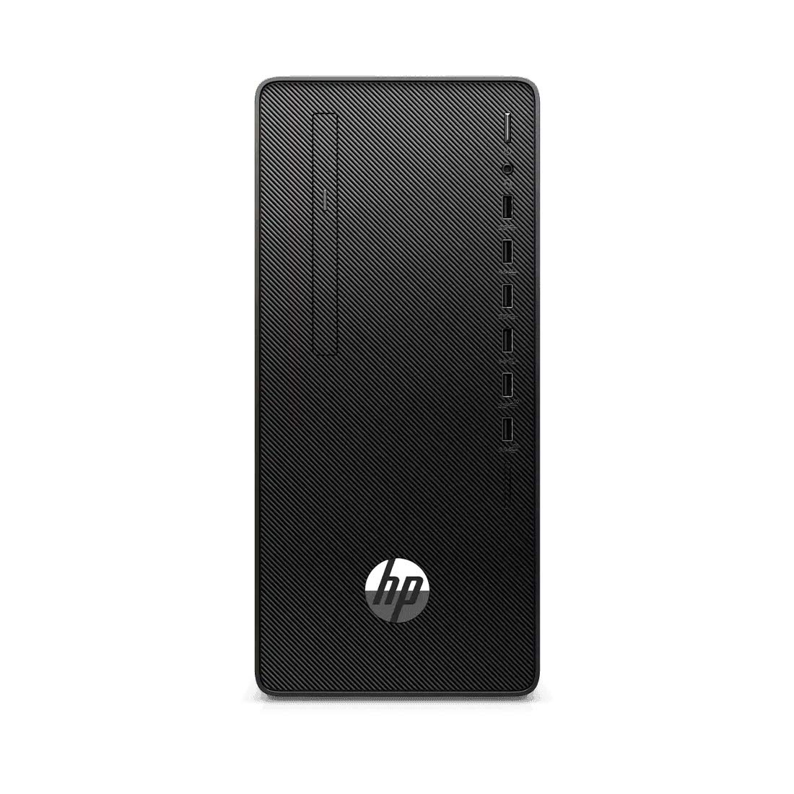
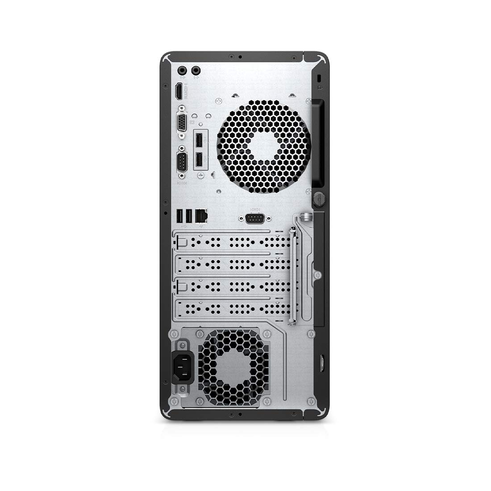
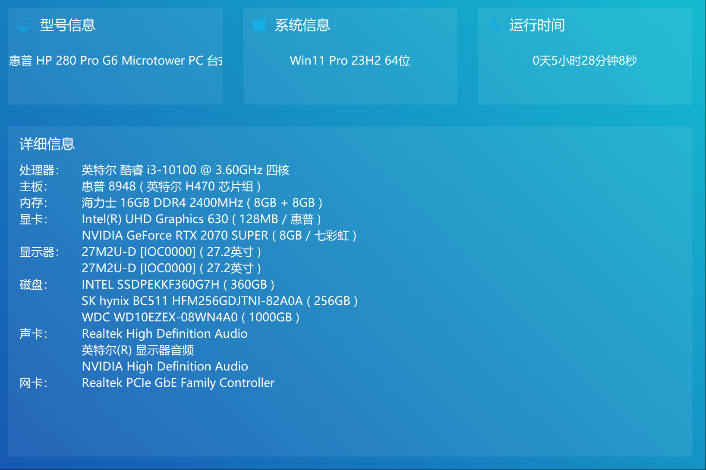

# HP-280ProG6-Hackintosh

HP 280 Pro G6 Microtower PC Hackintosh EFI

[HP 280 Pro G6 Microtower PC Product Page](https://hpstorerajkot.com/product/hp-280-pro-g6-microtower-pc-intel-core-i3-10100-4gb-1tb-hdd-free-dos-3-year-warranty-intel-uhd-graphics-wifi-bluetoothblack-385z2pa/?srsltid=AfmBOorXWHCa09rqBtTABySmbwuYVLYO0VsLFpvKBHvvS-Bxgu1rcift)

## 电脑配置

## 说明

当前使用的 `OpenCore` 版本为 `v1.0.2 Debug`，`macOS` 版本为 `Sequoia 15.1.1`。

使用主板上的 HDMI 接口输出显示，此接口在 `Windows` 下最高支持 4K 30Hz 输出，在 `macOS` 下未找到此规格，仅能以 2K 60Hz 输出，同时支持显示器音频输出，但音量无法调节；另外的 VGA 接口未测试，其可能的 `.plist` 配置如下：

`Root -> DeviceProperties -> Add -> PciRoot(0x0)/Pci(0x2,0x0)`

|             Key          | Type |             Value          |
| :----------------------: | :--: | :------------------------: |
| framebuffer-con0-enable  | Data |         01000000           |
| framebuffer-con0-alldata | Data | 01050900 00040000 87010000 |
| framebuffer-con1-enable  | Data |         01000000           |
| framebuffer-con1-alldata | Data | 02060900 00040000 87010000 |
